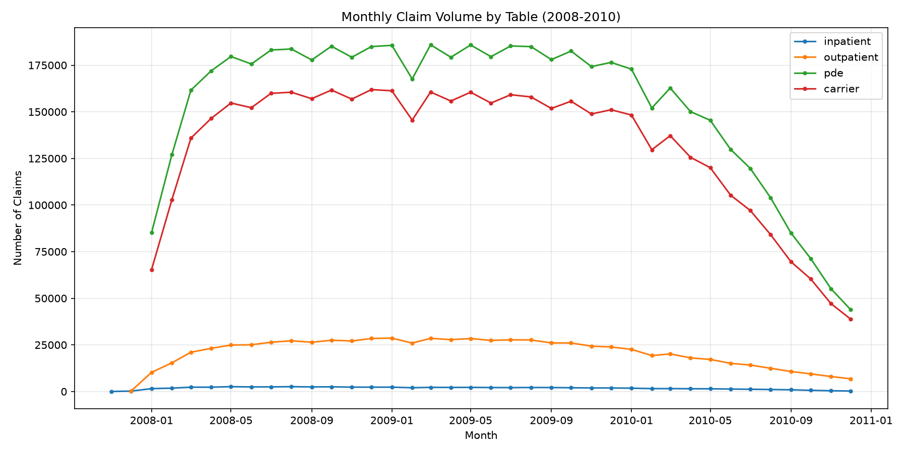
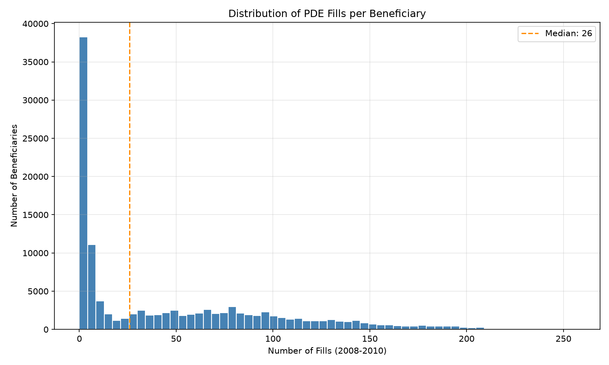
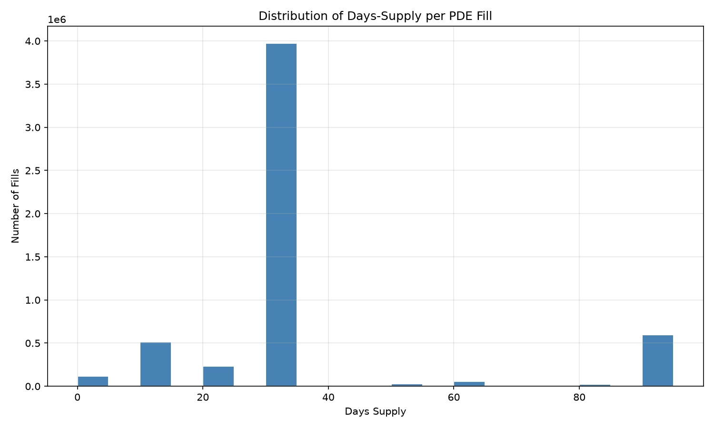
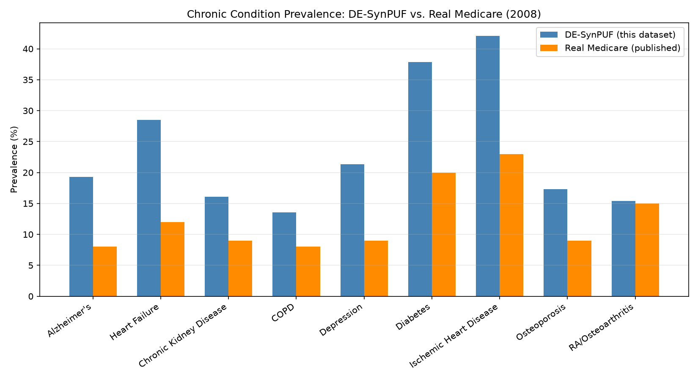
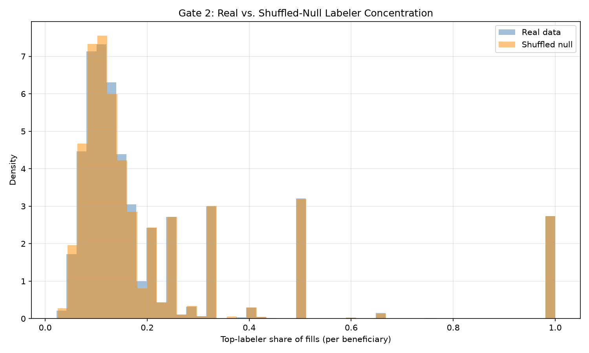
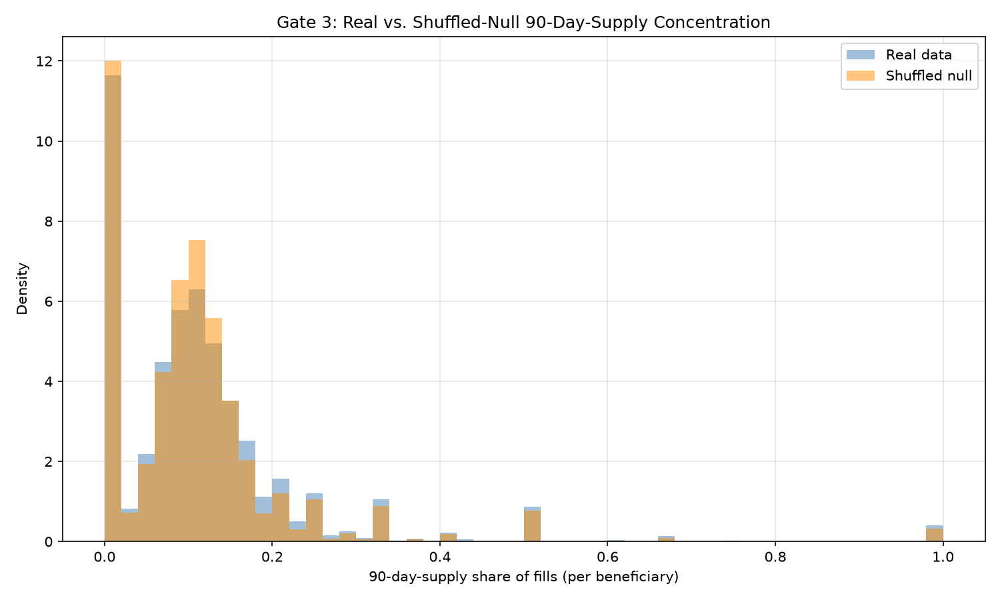

# Fidelity Audit: What Does DE-SynPUF Actually Preserve?

## Why this document exists

This project is built on CMS's DE-SynPUF dataset: a synthetically
generated version of real Medicare claims data, produced specifically so
people can build and test healthcare analytics without touching anyone's
actual medical records. I'm using Sample 1: roughly 116,000 beneficiaries,
three years of claims, 2008 through 2010.

Before building anything on top of this data, Week 2 of the project was
dedicated to actually understanding it by conducting a thorough exploratory data analysis: twelve specific questions about data integrity, timing, prescription patterns, demographics, and how well the data holds up against known real-world benchmarks. That EDA surfaced something that needed a much closer look: the prescription product codes weren't behaving the way real refill
data should. Rather than note that and move on, I ran it down properly:
six separate validation tests, each designed to answer one specific
question about what this dataset can and can't be trusted to tell you.
That work caught a couple of real mistakes in my own earlier analysis
along the way, and ultimately led to reworking one entire piece of the
project's planned design.

This document is the full writeup of that process, in order: what the
project is, what the data is, what the initial investigation found, what
the follow-up tests showed, and what all of that means for how the rest
of the project is built.

If you only read one sentence from this whole thing, make it this one:
**every claim below about what this data can or can't support is backed by
a specific, reproducible test. Not a guess or a disclaimer.**

## The one-paragraph version

Most of what this project needs from the data held up well: record counts,
costs, demographics, and whether someone filled a prescription at all in a
given month all check out cleanly and match published benchmarks. One
important thing did not hold up: this file does not preserve enough
information to track which specific drug a person was taking over time.
That turns out to be by design, not a flaw. A person's exact refill
history for a named drug is one of the most identifying pieces of
information in claims data, so it's precisely what a de-identification
process has to disrupt. The rest of this document shows the evidence for
that conclusion, and for everything else that turned out to be trustworthy
or not.

## Dataset overview

Sample 1 covers three years of Medicare claims for about 116,000
beneficiaries, split across eight raw files that get loaded into five
tables:

- **Beneficiary summary**, one file per year (2008, 2009, 2010), combined
  into a single table with a `source_year` column to keep track of which
  year each row came from. This holds demographics, chronic condition
  flags, and coverage details.
- **Inpatient claims**, hospital stays, spanning all three years in one file.
- **Outpatient claims**, non-hospital visits, same structure.
- **Prescription Drug Events (PDE)**, every prescription fill, the file
  this project depends on most heavily.
- **Carrier claims**, split across two files (A and B, purely due to file
  size), covering doctor visits and related billed services.

Everything was loaded into DuckDB with no changes made to the raw values,
not even basic type conversions. That was a deliberate choice: in my experience
cleaning up
data too early can quietly erase evidence of a problem before you've had
a chance to notice it. Every column was loaded as plain text first, so
that things like drug codes and diagnosis codes, which often have
meaningful leading zeros, wouldn't get silently mangled by a database
guessing they were numbers.

The rest of this document will walk you through what came out of actually looking
at this data closely.

## Part A: Does the data actually add up? (Data integrity check)

Before trusting any analysis built on top of this data, the first thing
worth checking was whether the basics are right: are the row counts what
they should be, is this actually the sample I meant to download, and does
every claim trace back to a real person in the file.

**Row counts.** CMS publishes the expected row count for each table in
Sample 1. Every one of my loaded tables matched exactly: 343,644
beneficiary-year records, 66,773 inpatient claims, 790,790 outpatient
claims, 5,552,421 prescription fills, and 4,741,335 carrier claims.

**Getting the right sample.** CMS's own download page has a known,
documented bug: the link labeled "Sample 1, 2010 Beneficiary Summary File"
sometimes actually serves a completely different batch called Sample 20.
If that swap happens unnoticed, every result that depends on tracking
someone across multiple years would be quietly wrong, since Sample 20
would contain a mostly different set of people. I checked this directly:
counted distinct beneficiaries in each year (116,352 in 2008, 114,538 in
2009, 112,754 in 2010, all matching CMS's published Sample 1 figures
exactly) and confirmed that essentially everyone present in the 2010 file
also appears in 2008. That overlap is the real tell: Sample 20 would show
almost no overlap with Sample 1's other years, since it's a different
group of people entirely. This check mattered enough that it's now a
permanent, automated test that reruns every time the data pipeline runs,
rather than something I checked once and moved on from.

**Orphan claims.** Every claim in the file is tied to a beneficiary ID.
If any claim pointed to an ID that didn't exist anywhere in the
beneficiary tables, that claim would be an orphan: no demographic or
health information to connect it to. Checked across all four claims
tables, and found zero. Every single claim traces back to a real
beneficiary record.

Nothing in this section raised a concern. The data is structurally sound,
correctly sourced, and fully linked.

## Part B: Does the timing make sense? And what happens near the end of the file. (The phenomena of "the 2010 decline")

**Date ranges.** Almost every claim falls inside the expected 2008-2010
window. A small number of hospital and outpatient claims (224 and 312
records, respectively) show dates in late November and December of 2007,
just before the study period officially starts. On closer inspection this
turned out to be completely ordinary: a patient admitted to the hospital
on, say, December 29, 2007 would naturally have a claim that starts in
2007, even though most of the stay happens in 2008. Not a data problem,
just how hospital billing works.

**The decline in claims volume through 2010.** This is the finding that
mattered. Plotting monthly claim volume across the full three years shows
a steady, healthy plateau from early 2008 through the end of 2009, then a
steep decline through all of 2010, ending the year at roughly a quarter
of the normal volume.

*Figure 1: Monthly claim volume by table, 2008-2010. Note the steady
plateau through 2009, followed by a steep decline through all of 2010.*

My first read on this was that it looked like ordinary claims lag: the
idea that the most recent months in any claims dataset always look
artificially thin, simply because some of those claims haven't finished
being processed and entered into the system yet. That explanation turned
out to be wrong, and a closer look at the actual shape of the decline is
what gave it away. Real claims lag only softens the last few months of a
dataset. It doesn't start in January of a year and get steadily worse for
eleven months straight. When I measured fills per enrolled beneficiary
month by month, February 2010, the second month of the year, was already
15% below the healthy 2009 average. That's simply too early and too steep
for a processing-delay explanation to hold up.

The more accurate description: something specific to how 2010 was
constructed in this file causes prescription activity to thin out
progressively across the year, starting almost immediately. Whatever the
underlying cause, the practical consequence is the same either way. Any
analysis that depends on someone's activity late in the file, particularly
anything meant to represent "this person stopped filling prescriptions,"
needs to treat data from February 2010 onward with real caution. That
month became the natural cutoff for defining a clean, trustworthy analysis
window later in the project.

## Part C: What do prescription fills actually look like? (And the discovery that changed the project)

**Who's filling anything at all.** About 14.5% of beneficiaries never
filled a single prescription across the entire three years. Among
everyone else, the typical person filled about 26 times over three years,
with a long tail of much heavier users, some filling well over a hundred
times, likely people managing several chronic conditions with several
medications at once.

*Figure 2: Distribution of prescription fills per beneficiary, 2008-2010.
The tall bar near zero reflects both the zero-fill population and a large
group of low-intensity users, with a long, thin tail extending past 200
fills.*

**How long each prescription lasts.** The dominant pattern is exactly what
you'd expect from real pharmacy practice: about 72% of all fills are a
30-day supply, the standard monthly refill. Another 11% are 90-day
supplies, consistent with mail-order or long-term prescription programs.
A small share, about 2%, show a days-supply of zero. CMS's own
documentation for this file states plainly that this kind of anomaly
should be expected and isn't something to treat as an error.

*Figure 3: Distribution of days-supply per fill. The sharp peak at 30
days and secondary peak at 90 days both match realistic pharmacy
patterns.*

**The discovery.** Every prescription fill in this file is tagged with a
specific product code, the equivalent of a barcode identifying the exact
drug and package (the formal term is an NDC, National Drug Code). If a
real person keeps taking the same medication month after month, you'd
expect to see that same product code show up again and again in their
records. It essentially never does.

I found this by accident while doing something the project plan called
for as a sanity check: picking one high-volume product code and reading
through a real patient's fill history by hand, just to see if the pattern
looked like a plausible refill schedule. It did, in terms of timing. The
gaps between fills lined up sensibly with the days-supply of each
prescription. But not one of that patient's 39 fills shared the same exact
product code as another. Every single fill had a different code, even
though many of them shared the same manufacturer prefix.

That could have been one unusual patient, so I checked it across the
entire file. Out of about 5.5 million fills, only 0.06% of "same patient,
same exact product code" pairs ever repeat. This isn't an unusual case,
it's close to the norm across the whole dataset.

**Why this happens, and why it isn't a flaw.** The most likely explanation
is also the most reassuring one. A person's specific sequence of refills
for a specific named drug is one of the most identifying pieces of
information in health data. If you know someone filled the exact same
diabetes medication every 30 days for three years, that pattern alone
could plausibly be used to re-identify them, especially combined with a
few other details. Disrupting that pattern is very likely a deliberate,
necessary part of how this file protects real people's privacy, not
carelessness in how it was built.

The practical consequence for this project: individual drug identity
cannot be tracked reliably in this dataset, and that turns out to be true
of essentially any similarly de-identified public health dataset, not
just this one. Anything in the project that depended on comparing one
named drug against another had to be rebuilt around a different approach,
described later in this document.

## Part D: Do the patients look real, and do things that should be related actually behave that way? (Demographics and the three correlation pairs)

**Basic demographics.** Age, sex, race, and state distributions all
matched CMS's own published figures closely, in most cases to within a
decimal point. The age distribution looks exactly like a real Medicare
population: mostly 65 and older, with a smaller group of younger
beneficiaries who qualify early, typically through disability. Nothing
here raised any concern.

**Chronic condition rates.** This is where a real, consistent gap showed
up. Every one of the eleven chronic conditions tracked in this file
(diabetes, heart failure, depression, and so on) appears between 1.6 and
2.4 times more often here than published real-world Medicare rates. This
wasn't a one-off oddity in a single condition, it showed up across the
board, which points to it being a genuine, systematic side effect of how
the file was built rather than noise.

*Figure 4: Chronic condition prevalence in this dataset compared against
published real-world Medicare rates. Every condition checked runs
noticeably higher here.*

**Do related things actually move together?** The last piece of the
initial investigation was checking three pairs of variables that should
logically track each other in real medical data, and seeing how well that
held up.

The first pair, age against number of chronic conditions, initially looked
broken: a very weak relationship, with an odd dip in the 60 to 69 age
range. That conclusion turned out to be wrong, and catching the mistake
came from an outside review of the findings before anything got written
down permanently. The dip isn't a data problem at all. Medicare
beneficiaries under 65 mostly qualify through disability or kidney
disease, which makes them, on average, sicker than someone who simply
turned 65 and enrolled normally. A dip right around that boundary is
exactly what real Medicare data should look like. Restricting the check to
beneficiaries 65 and older, and using a correlation measure better suited
to this kind of pattern, shows a real, steadily increasing relationship
between age and condition count, modest in size but consistent, with no
dip anywhere in it.

The second pair, number of hospital admissions against hospital
reimbursement, also needed a correction, this time a straightforward bug
rather than a misread finding. The original version compared three years
of admissions against only one year of reimbursement, which meant anyone
whose single hospital stay happened to fall in 2009 or 2010 looked like
they'd cost nothing in 2008. Once both sides of the comparison were
restricted to the same year, the relationship came out much stronger and
far more believable, including realistic dollar amounts for a single
hospital stay.

The third pair, chronic condition count against total yearly cost, didn't
need any correction. It showed a real, moderately strong relationship from
the start, and it still does: more documented conditions consistently mean
higher total spending.

Put together, these three checks tell a consistent story. Relationships
that live entirely within a single claim or a single bill hold up well.
Relationships that require connecting two separately generated parts of a
person's record, like their age and their list of health conditions, are
weaker than they should be, though not necessarily broken outright once
you account for real-world structure like the disability-eligibility
pattern above.

## Part E: Six tests to settle exactly what this data can support

The drug-identity discovery in Part C raised a bigger question worth
answering properly rather than assuming: if individual drug codes are
this unreliable, what else in this file might look fine on the surface but
fall apart under closer inspection? After a huge strategy session with sources
far smarter than me, Six specific tests were built to
answer that, each one aimed at a single, precise question, with the
outcome decided in advance for every possible result. That last part
mattered. It meant no test could quietly turn into a reason to second-guess
the whole project. Whatever came back, there was already a clear next step
attached to it.

A few of these tests use a technique worth explaining once, since it comes
up repeatedly: a shuffle test, sometimes called a permutation test. The
idea is simple. Take the thing you're suspicious of, whether that's which
manufacturer a person's fills come from or how long their prescriptions
tend to last, and deliberately scramble it at random, breaking any real
connection to that person on purpose. Then compare the real data against
this scrambled version. If they look basically the same, whatever pattern
you thought you saw in the real data was probably never really there. If
they look meaningfully different, that's solid evidence the pattern is
real.

**Gate 1: does the "no repeated drug codes" finding hold up across the
whole file, not just one patient?** Yes. Checked against all 5.5 million
prescription fills, only 0.06% of patient-and-exact-drug-code pairs ever
repeat. Checked at the coarser manufacturer level instead of the exact
drug code, the repeat rate rises to about 18%, which sounded promising
until Gate 2 explained what that number actually means.

**Gate 2: is that manufacturer-level repetition a real personal pattern,
or just what you'd expect by chance?** This is where the shuffle test
came in directly. Real data and a randomly scrambled version of the same
data produced statistically identical results.

*Figure 5: How concentrated each beneficiary's fills are around their
single most common manufacturer, real data versus a randomly shuffled
version. The two distributions overlap almost completely.*

In plain terms, the 18% figure from Gate 1 isn't evidence of a real habit,
it's just what naturally happens when a handful of manufacturer codes
dominate the file overall. Manufacturer-level grouping doesn't carry
trustworthy person-level signal either.

**Gate 3: is a preference for 90-day prescriptions over 30-day ones a real
personal trait?** Same shuffle-test approach, applied to prescription
length instead of manufacturer. The result here was more mixed. Real data
did show slightly more consistency than the scrambled version, and a
formal statistical test confirmed the difference was real rather than
noise. But the size of that difference was small.

*Figure 6: Share of each beneficiary's fills that are 90-day supplies,
real data versus a randomly shuffled version. The two distributions are
close, with a small but statistically real gap.*

**Gate 4: exactly when does the 2010 decline from Part B actually start
breaking things?** Measuring fills per enrolled beneficiary month by
month, February 2010 was already 15% below the healthy 2009 average, and
every month after that got worse, ending the year at about a quarter of
normal. This confirmed the claims-lag explanation from Part B was wrong
and set a hard, specific boundary: data from February 2010 onward should
be treated with real caution in any later analysis.

**Gate 5: are the top manufacturer codes even real companies?** Looking
the five most common manufacturer codes up in the FDA's official drug
directory, none of them returned any results. A couple of manufacturer
codes further down the popularity list did turn out to be real, findable
companies, though one of them repackages many unrelated drugs under a
single code, which means even a real manufacturer code wouldn't reliably
tell you what specific drug someone was taking. Worth being precise about
what this test does and doesn't prove: the FDA directory only lists
currently marketed products, so a code returning no results today doesn't
by itself prove it was invented rather than simply belonging to a company
that no longer operates. The stronger evidence that these codes carry no
real signal is Gate 2, above. This lookup is supporting evidence, not the
main proof.

**Gate 6: does the timing between prescription refills carry any real
meaning, beyond just how many prescriptions someone filled overall?** This
was the most important remaining question, since the whole idea of
"medication persistence" depends on being able to say a long gap between
fills represents a real, meaningful pause or stop.

Three parts to this one. First, does a 90-day prescription actually
produce a longer wait before the next refill than a 30-day one, the way
it logically should? Barely. The typical wait was about 47 to 48 days
either way, and a shuffle test confirmed this wasn't noise hiding a real
effect. Second, and this is the one that mattered most: beyond simply how
many total fills a person had, does the specific spacing between those
fills carry any extra meaning? Each person's fill count was kept exactly
the same, but their fill dates were randomly scattered across their own
observation window, and the result compared against reality on three
separate measures. All three came back essentially identical between the
real data and the randomly scattered version. Third, is the prescription
data at least meaningfully connected to the rest of a person's health
record, so that sicker people, by chronic condition count, actually tend
to fill more? Yes, modestly.

Taken together, gate six's second result is the one with the most weight.
A long gap between fills in this file doesn't represent a real event where
someone actually stopped or paused their medication. It's simply a
mathematical consequence of how many fills a person has and how long their
observation window is. That's a bigger finding than any single drug-code
issue, because it means the concept of "this person stopped taking their
medicine," measured purely from timing gaps, isn't something this
particular file can support on its own.

**What this adds up to.** Across all six gates, a consistent pattern
emerges. Anything measured or counted within a single claim survives the
scrambling process intact: costs, admission counts, whether someone filled
anything at all in a given month. Anything that depends on connecting one
claim to another for the same person, which drug, which manufacturer, and
very nearly how long each prescription lasts, does not survive. The one
piece of encouraging news is that the file's overall structure, meaning
how a person's prescription activity relates to their broader health
profile, remains intact enough to build on.

## Constraints this places on the analysis

Everything above adds up to a specific, usable list of boundaries for the
rest of this project. Rather than leave these scattered across the
sections above, here they are gathered in one place.

**Individual drug identity cannot be tracked.** No comparison of one named
drug against another, no "did this person stay on their diabetes
medication," is reliable in this file. This isn't unique to this dataset.
Any similarly de-identified public claims file is likely to have the same
limitation, since it's the same protection mechanism doing the same job.

**A long gap between fills is not a reliable signal of a real pause or
stop.** Gate 6 showed this is close to pure arithmetic, driven by how many
fills someone has and over what span, not a genuine behavioral event.
Anything built on "time since last fill" as a marker of discontinuation
needs to be treated as unproven on this file.

**Manufacturer-level grouping does not carry real person-level signal
either.** It looked promising at first glance, but the shuffle test in
Gate 2 showed it's statistically indistinguishable from chance.

**Prescription length (days supply) is only loosely connected to a
person's actual behavior.** It's reliable enough to describe overall
patterns in the file, like the dominance of 30-day fills, but not reliable
enough to build a precise, per-person coverage calculation on top of.

**Data from February 2010 onward should be treated with caution.** The
decline identified in Part B and confirmed in Gate 4 means analysis
windows extending past this point risk mistaking a data artifact for real
patient behavior.

**Chronic condition rates run consistently higher than real-world
Medicare figures.** Any comparison against outside benchmarks needs to
account for this, and any finding phrased as a rate or a prevalence should
be treated as a property of this file, not a real-world estimate.

That makes me happy for all the beneficiaries whose identities are preserved and thoroughly anonymised. And slightly melancholic, that my planned way of measuring discontinuation or adherence/rentention is dead, though what replaces it turns out to be more standard practice than what I'd planned. So there is light at the end of the tunnel.

**What remains solid.** Record counts, costs, hospital admissions, whether
someone filled anything at all in a given month, and the overall
connection between a person's health profile and how much they use the
healthcare system all held up under testing. These are the load-bearing
pieces the rest of the project builds on.

## What changed in the project as a result

None of the above meant starting over. It meant being honest about which
specific pieces of the original plan depended on something this dataset
can't actually deliver, and swapping those pieces for alternatives that
rest on what the data has already proven it can support. The project's
written plan was updated to reflect this, and the changes are summarized
here rather than buried across six weeks of design documents.

**Adherence and retention are not dead, one specific way of measuring
them is.** The original plan leaned on a detailed, clinically standard
adherence measure called PDC, Proportion of Days Covered, which depends on
trusting prescription length data at the individual level. Gate 6 showed
that trust isn't warranted here. The project's primary metric moved to
something simpler and, as it turns out, more standard in the tech world
this project also speaks to: whether a person filled anything at all in a
given month. PDC is still calculated and reported, but labeled honestly as
unreliable on this file rather than presented as a clean number. The
underlying idea, that staying engaged with your medication looks like
staying engaged with a subscription, is untouched. Only the precise way of
measuring "still engaged" had to change.

**The plan to compare two named drugs against each other is gone, and
couldn't have survived on any similarly built dataset.** In its place, the
project now uses a technique called a plasmode simulation: build a real
patient group with real characteristics from this file, then intentionally
add a made-up treatment and a made-up effect where the true answer is
already known, and check whether the statistical methods correctly find
that known answer. This is a well-regarded technique in health research
specifically because it proves the tools work correctly on realistic data,
rather than producing a real-world finding that can't actually be trusted
here anyway.

**The prediction model shifted its story rather than its build.** It's
still being built, and it's still aimed at the same underlying question
of predicting who's likely to drop off. What changed is what it's honestly
described as predicting. Since Gate 6 showed that timing gaps mostly
reflect fill frequency rather than a real behavioral stop, the model's
explanation of its own predictions is expected to lean heavily on how
often someone fills things overall, and the write-up says so plainly
rather than dressing that up as something more clinically dramatic than
it is.

**The analysis time window narrowed.** Combining the February 2010
cutoff from Gate 4 with the standard requirements of a clean before-and-
after study design, settled on beneficiaries with a relevant event between
July 2008 and July 2009, with outcomes measured entirely before the data
quality starts to break down.

**Every one of these changes came with a plan for what to do if the
underlying test had gone the other way**, decided before the tests were
run, not after. That's worth stating plainly: nothing in this document is
a project in crisis being patched together after the fact. It's a project
that checked its assumptions before building on them, found two that
didn't hold, and had already planned for exactly that possibility either
way it went.
